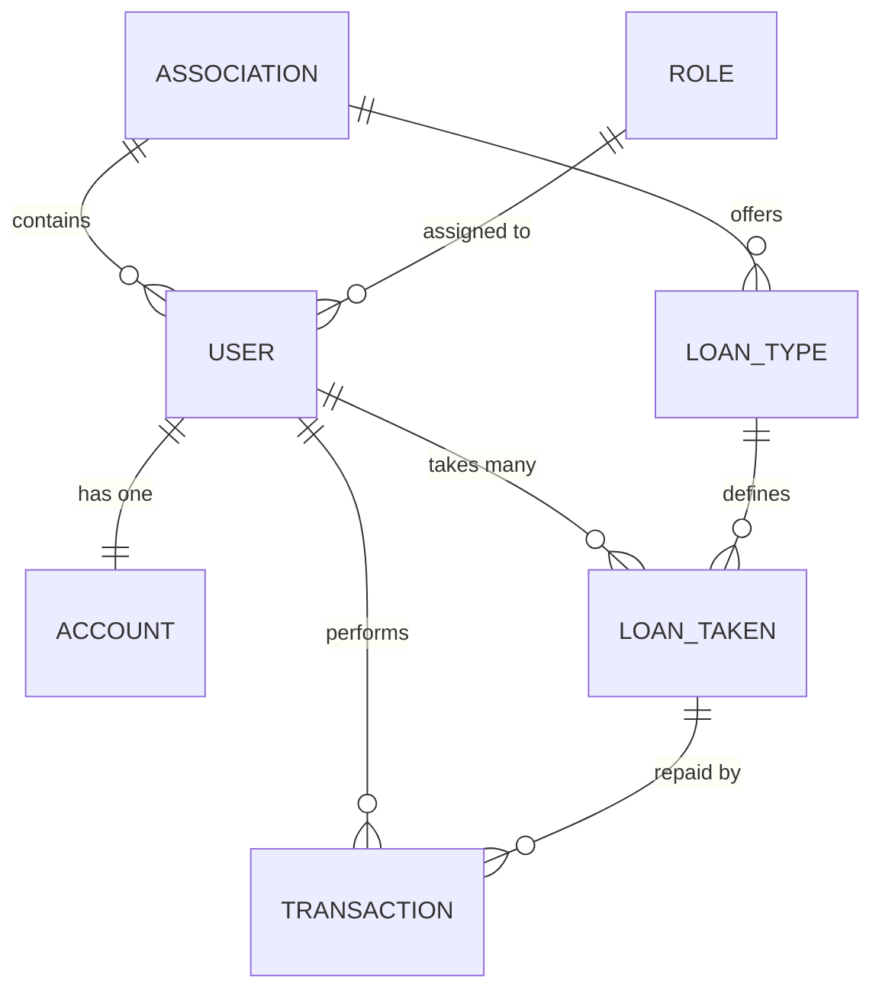

This is a comprehensive **README.md** file tailored for your Cooperative Management System (ONWARD). It outlines the architecture, the entity relationships, and the system's core functionality.

---

# ONWARD Cooperative Management System

ONWARD is a multi-tenant management platform designed for Cooperative Societies and Credit Unions. It allows a **Super Admin** to oversee multiple associations, while specific **Admins** manage day-to-day operations like savings, share contributions, and loan management for members.

## 🚀 Core Features

- **Multi-Tenancy:** Support for multiple independent cooperative associations (e.g., ONWARD, EXCEL, etc.).
- **User Management:** Role-based access control (Super Admin, Admin, Member).
- **Flexible Loan Engine:** Create various loan products with custom interest rates and liquidity periods.
- **Multiple Loans:** Users can apply for and run multiple loans simultaneously.
- **Financial Ledger:** Track every transaction including Savings, Shares, and Loan Repayments.
- **Audit Trail:** Every payment is linked to the Admin who recorded it for transparency.

---

## 🏗️ Domain Model (Object Mode)

The system is built around the following core entities:

### 1. Association (The Tenant)
The top-level organization created by the Super Admin.
- `id`: Unique identifier.
- `name`: Name of the cooperative (e.g., "ONWARD").

### 2. User & Role
- **User:** Represents every person in the system. Linked to an Association and a Role.
- **Role:** Defines permissions (Super Admin, Admin, Member).

### 3. Account (The Ledger Summary)
A financial profile for each member.
- `total_shares`: The value of ownership shares held by the member.
- `savings_balance`: The liquid cash a user has saved.
- `total_interest_accrued`: Cumulative interest earned by the member.

### 4. Loan Management
- **LoanType:** The "Product" template (e.g., *Business Loan*, *Emergency Loan*). Defines the `annual_interest_rate` and `liquidity_period`.
- **LoanTaken:** A specific loan instance. Tracks the `principal_amount`, `total_payable` (including interest), and the `balance_remaining`.

### 5. Transaction
A record of every financial movement.
- `transaction_type`: (Repayment, Savings Deposit, Share Purchase).
- `admin_id`: The ID of the admin who manually processed the payment.
- `loan_id`: (Optional) Links the payment specifically to a loan if it is a repayment.

---

## 🛠️ System Actors

### 👤 Super Admin
- Create and manage Cooperative Associations.
- Assign Association-level Admins.
- System-wide reporting and analytics.

### 👤 Admin (Association Manager)
- Onboard and manage Users (Members).
- Define Loan Types and interest rates.
- Input and verify manual payments from users.
- Approve or Reject loan applications.

### 👤 Member (User)
- Contribute to Savings and Shares.
- Apply for one or more Loans.
- View personalized financial statements and loan balances.

---

## 📈 Logical Workflow

1. **Setup:** Super Admin creates the association "ONWARD" and assigns an Admin.
2. **Product Creation:** Admin creates a "Standard Loan" type with a 10% interest rate.
3. **Onboarding:** Admin creates a User profile for a member.
4. **Loan Disbursement:** User requests a loan. Admin approves it. A `LoanTaken` record is generated, calculating the `Total_Payable` based on the `LoanType` interest.
5. **Repayment:** When a user pays, the Admin logs a `Transaction`. The system automatically subtracts the amount from the `LoanTaken.balance_remaining` and updates the user's `Account` summary.

---

## 🗄️ Database Schema Representation

---

## 📝 License
This project is proprietary. Unauthorized copying of this file, via any medium, is strictly prohibited. 

**Developed for ONWARD Cooperative Management.**